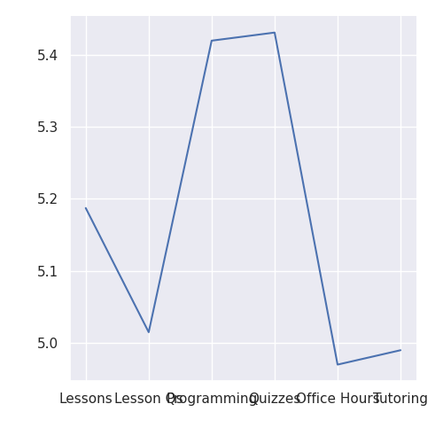
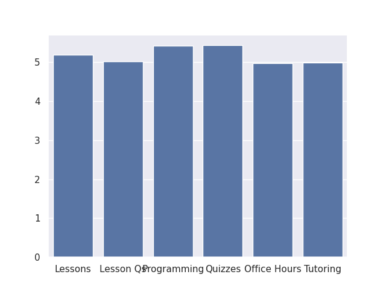

---
# Do not edit the text between these lines!
layout: default
---

---

# COMP110 Resource Effectiveness Analysis
By: Elaha Fariady

## Overview

For this project, we analyzed survey data from COMP110 students to understand which course resources are most effective for learning. We focused on resources such as lesson videos, post-lesson questions, programming assignments, quizzes, office hours, and tutoring.

The goal was to identify which resources create the most value for students and how the course could be improved based on real data.

---

## Visualizations

### Chart 1: Average Effectiveness of Course Resources

This chart shows the average effectiveness rating for each resource. Lesson videos and post-lesson questions appear to have the highest ratings.

---

### Chart 2: Distribution of Resource Effectiveness

This chart shows how effectiveness ratings are distributed across different resources.

---

### Chart 3: Resource Effectiveness Comparison

This visualization compares how different learning tools perform relative to each other.

---

## Conclusion

The results suggest that lesson videos and post-lesson questions are the most effective learning resources in COMP110. These tools are built directly into the course and are consistently used by students, which likely explains their strong impact.

Programming assignments are also helpful, but slightly less effective in comparison. Office hours and tutoring show lower ratings, which may be because fewer students use them regularly or only seek them out when struggling.

Based on this analysis, improving lesson videos and post-lesson questions would likely have the greatest impact on student learning. However, this may require additional time and effort from instructors. In the future, collecting more data on how often students use each resource could provide deeper insights.

---